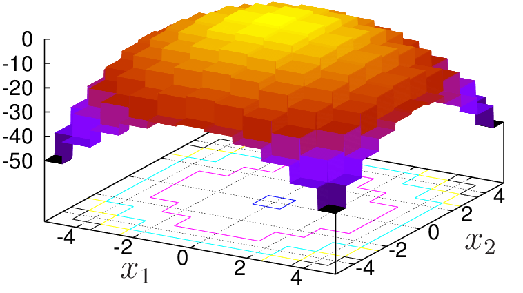
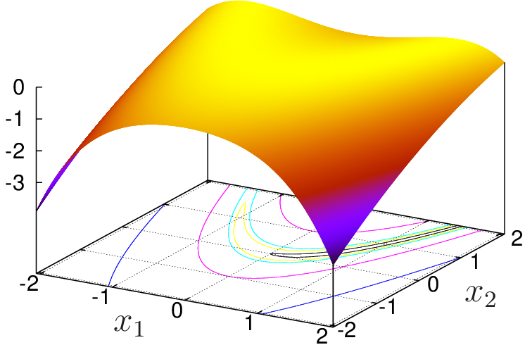
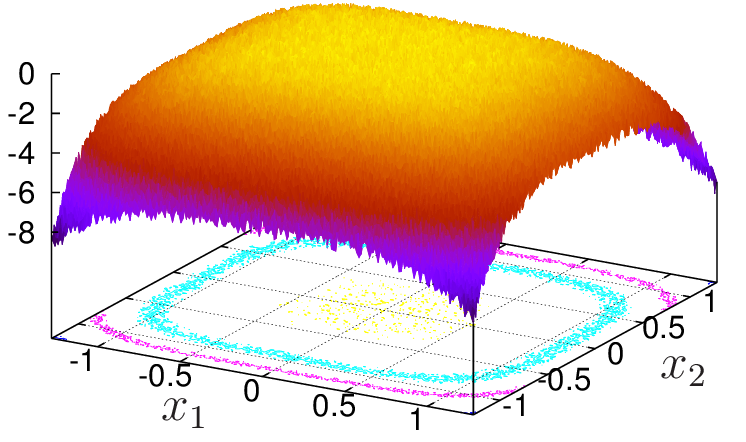
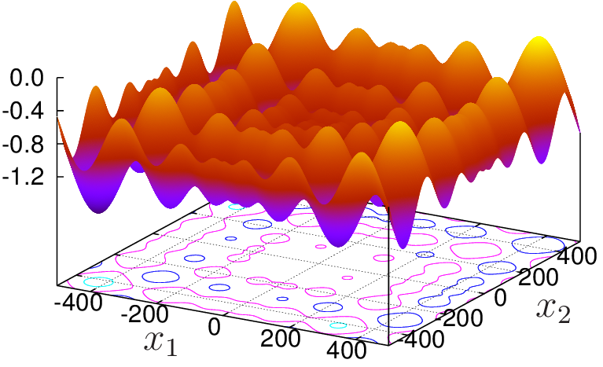

# Summary

Optimization is a mathematical problem often found in science and engineering. Currently, however, there is no general method to face this problem. Solutions are generally addressed by two approaches, both iterative: (a) quasi-Newton methods [@Griva:2009] and (b) heuristic methods [@Coley:1999; @Feoktistov:2006]. Each one has advantages depending on the problem to be optimized. Quasi-Newton methods, in general, converge faster then heuristic methods, provided the function to be optimized (the objective function) is smooth. Heuristic methods, on the other hand, are more appropriate to deal with noisy objective functions, to handle failures in the calculation of the objective function and are less susceptible to be retained in local optimum than quasi-Newton methods. 

Among the heuristic methods, Differential Evolution (DE)[@Storn:1997; @Price:2005] had emerged as a simple and efficient method for finding the global maximum. This method is based on the principles of biological evolution.

To combine the robustness of heuristic methods with the high convergence speed of quasi-Newton methods, Loris Vincenzi and Marco Savoia [@Vincenzi:2015] proposed coupling Differential Evolution heuristic with Response Surfaces [@Khuri:1996; @Myers:2009]. Fitting Response Surfaces during optimization and finding their optima mimics quasi-Newton methods. The authors showed that this approach reduced significantly the effort to solve some problems within a given tolerance (in general, more than 50% compared to the original heuristic method). 

Based on the paper of Loris Vincenzi and Marco Savoia, but applying a different algorithm, a software called ``DEPP``, an acronym for Differential Evolution Parallel Program, was elaborated. ``DEPP`` source code is written in Fortran 2008 standard[@Brainerd:2015], it is based on the object-oriented paradigm and it includes MPI paralellization[@Tennessee:2009]. The main algorithm was elaborated to simplify the development and extension of the code, relying on abstract classes and polymorphism. Following this idea, design patterns [@Freeman:2004] were also applied. Object instances are generated through the Factory Design Pattern and Adapter Design Pattern was applied to encapsulate MPI commands, for instance. In this way, users may implement new optimization methods without changing the main algorithm. 

Due to its supporting theory, ``DEPP`` is well suited to address optimization problems of multimodal, noisy, poor-precision-calculated and failure-susceptible objective functions, taking advantage of acceleration provided by parallelization and hybridization models, like Differential Evolution-Response Surface coupling. 

In the following sections, a brief description of DEPP, its supporting theory, and some examples are presented. 

Software description {#sec:description}
====================

Software Architecture {#sec:arch}
---------------------

DEPP is written in FORTRAN 2008 standard language[@Brainerd:2015] with the Message Passing Interface (MPI) directives[@Tennessee:2009] and takes
advantage of the Object-Oriented Paradigm.

The folder structure of DEPP is shown in Figure 1. The directory *depp\_input* contains the input (text) files that define
the control parameters of the optimization. Results of DEPP are saved into *depp\_output* directory. The source code is within *depp\_src* directory. This directory also contains the Bash[@Ramey:2016] script *compile.sh*, which compiles DEPP source code and generates the executable *depp.x* in the root of the file structure.  The interface between DEPP and the external program (EP), which calculates the objective function, is defined in the *interface* directory. Finally, the script *run.sh* runs DEPP using MPI.

{width="50.00000%"}

Thanks to Object-Oriented Programming, the source code was designed to simplify the implementation of new methods. The algorithm works on
abstract classes separated, basically, as (i) population initializers, (ii) search strategies, (iii) fitness calculation and (iv) stop conditions. The concrete classes are generated using the Factory Design Pattern[@Freeman:2004]. All MPI commands are encapsulated into proper classes, following the logic of the Adapter Design Pattern. In this way, users interested in the implementation of new methods will not concern about MPI details.

Interfacing DEPP with an external program is exemplified in *interface* directory. This folder contains three examples based on C++ and FORTRAN 2008 languages, although many other programming languages may be used for interfacing.

The basic algorithm of DEPP is illustrated in Figure 2. DEPP reads the input data from *depp\_input* directory (optionally, it may start from some backup). The stop condition is analyzed. In the first iteration, the stop condition is generally not satisfied (it may not be true when starting from a
backup). When the stop condition is satisfied, the iterative procedure is finished and the output data is saved in the *depp\_output* directory. Otherwise, a trial population is generated. DEPP sends the information to a set of threads (T1,$\cdots$, TN) using MPI. Then, each of these threads runs a copy of the external program (EP) for a given individual of the population. After that, DEPP receives the calculated objective function and compares their fitness with the fitness of the current
population. Only the best individuals are held. A backup is optionally generated and the iterative cycle is restarted. During the calculation of the objective function, some failures may occur. DEPP handles failures using an error code returned by the external program. If the error code is 0, the calculations were performed correctly; if 1 is returned, then a failure occurred and the trial individual is discarded; if 2 is returned, then a failure occurred, the trial individual is discarded and a new one is generated. All the failures are registered for the posterior user’s analysis.

{width="55.00000%"}

Supporting theory {#sec:theory}
-----------------

The following sections describe the optimization theory behind the current implementation of DEPP. It must be emphasized that DEPP was designed based on an Object-Oriented Paradigm, in such a way to simplify the implementation of new and better methods.

### Differential Evolution {#sec:DE}

Differential Evolution algorithm is based on the principles of biological evolution. Basically, it works as follows. Given a population (set of discrete points in the domain of search), new individuals (trial points) are generated by “mutation” and “crossing over”. Here, “mutation” means a rule for creating new trial individuals while “crossing over” means a rule of exchanging information between a trial individual and an individual of the population. The fitness (objective function) of the new individuals is compared to the fitness of the parent individuals and the worse individuals are eliminated. The procedure is repeated for several generations (iterations) until a criterion of convergence is satisfied within a given tolerance.

Current version of DEPP focus on a particular kind of maximization problem, often found in practical applications, i.e.,
$$\begin{aligned}
        \underset{\boldsymbol{x}}{\text{maximize}} &\quad f(\boldsymbol{x}) \\
        \text{subject to}&\\
        &\quad \boldsymbol{L} \le \boldsymbol{x}  \le \boldsymbol{U},
\end{aligned}
\label{eq:maximization}$$ 
where $f$ is a real valued function, also known as objective function, depending on a D-dimensional vector $\boldsymbol{x}=(x_1, \cdots, x_D)$ of real variables. The variable $\boldsymbol{x}$ is confined in a box with lower $\boldsymbol{L}=(L_1,\cdots, L_D)$ and upper $\boldsymbol{U}=(U_1,\cdots, U_D)$ bounds.

The first step toward solving this optimization problem is the population initialization. For the first generation ($g=1$), a population (set of points) $\{\boldsymbol{x}_i\}$ $1\le i \le N_p$ is created randomly within the box $\boldsymbol{L} \le \boldsymbol{x}  \le \boldsymbol{U}$, *e.g.* 
$$x_{ij}=L_j+(U_j-L_j) \mathcal{R},\quad 1\le j \le D,$$ 
where $\mathcal{R}$ is a random number uniformly distributed in $[0,1)$ and $x_{ij}$ is the $j$-th element of the $i$-th individual.

After the population initialization, the fitness of each individual $\boldsymbol{x}_i$ is calculated.

For the next generations, trial individuals are calculated based on the population of the previous generations. Trial individuals are created by a process of mutation and crossing over as follows. For each individual $\boldsymbol{x}_i$ of the previous population, other three distinct individuals ($\boldsymbol{x}_{i_1}$, $\boldsymbol{x}_{i_2}$ and $\boldsymbol{x}_{i_3}$) of the same population are randomly selected and a mutant individual $\boldsymbol{v}$ is created 
$$\boldsymbol{v}=\boldsymbol{x}_{i_1}+F(\boldsymbol{x}_{i_3}-\boldsymbol{x}_{i_2}),$$ 
where $F$ is the differentiation parameter. Then, the mutant individual suffers a crossing over with $\boldsymbol{x}_i$, that produces the trial individual $\boldsymbol{u}$. The components $u_j$ ($1 \le j \le D$) of $\boldsymbol{u}$ are given by 
$$u_{j}=\begin{cases} 
v_{j} &  \text{if}~~\mathcal{R} < C_r~~\text{or}~~j = j^*, \\
x_{ij} & \text{otherwise}.
\end{cases}
\label{eq:crossover}$$ 
In previous equation, $C_r$ is the crossover parameter and $j^*$ is an integer randomly chosen between 1 and $D$. If the trial individual violates the constraints, i.e. if it is not within $\boldsymbol{L} \le \boldsymbol{u} \le \boldsymbol{U}$, then the process of generating a trial individual is repeated.

The fitness of the trial individual is compared to the fitness of $\boldsymbol{x}_i$. If $f(\boldsymbol{x}_i)\le f(\boldsymbol{u})$, then $\boldsymbol{u}$ replaces
$\boldsymbol{x}_i$. This is the so called selection.

New generations are created until a stopping condition is satisfied. DEPP implements a composition of the following stopping conditions: (i) best fitness stagnation, (ii) maximum number of generations and (iii) population convergence measure. In the first one, the generation cycle is interrupted if no improvement of the fitness function is achieved within $N_A$ generations. The second condition establishes the maximum number of generations allowed. Finally, in the third condition, the
cycle is interrupted if the P-measure $P_m$[@Feoktistov:2006] is lower or equal to a given tolerance. P-measure is evaluated as
$$P_m=\max_{1 \le i \le N_p} |\boldsymbol{x}'_i-\boldsymbol{x}'_m|,$$ 
where $|\cdot|$ is the $L_2$ norm, the components of $\boldsymbol{x}'_i$ are given by
$$x'_{ij}=\frac{x_{ij}-L_j}{U_j-L_j}, \quad 1 \le j \le D$$ 
and
$$\boldsymbol{x}'_m=\frac{1}{N_p}\sum_{i=1}^{N_p}\boldsymbol{x}'_i.$$

The approach presented in this section has three parameters: the population size $N_p$, the differentiation parameter $F$ and the crossover parameter $C_r$. @Feoktistov:2006 gives reference values/ranges of these parameters based on optimization studies performed on many test functions.

### Differential Evolution and Response Surface Methodology {#sec:DERSM}

In order to accelerate the convergence of DE, @Vincenzi:2015 proposed a new mutation operation based on the Response Surface Methodology (RSM)[@Khuri:1996; @Myers:2009]. The basic idea consists of fitting a simple response surface to a selected set of individuals of the population. The mutant vector is, then, obtained by
maximizing the response surface, which is done through matrix inversion. For a given benchmark, the authors showed that the number of generations necessary to reach a given precision was substantially reduced (more than 50%).

Vincenzi and Savoia considered two response surfaces. The first one is a quadratic polynomial $P(\boldsymbol{x})$, given by
$$P(\boldsymbol{x})=\beta_0+\sum_{i=1}^D\beta_i x_i+\sum_{i=1}^D\beta_{ii} x_i^2+\sum_{i=1}^{D-1}\sum_{j=i+1}^D\beta_{ij} x_ix_j,
\label{eq:quadratic}$$ 
where $\beta$ are coefficients to be fitted. The quadratic polynomial has $N_{f_m}=(D+1)(D+2)/2$ coefficients and, so, it requires, at least, the same number of points to be fitted. Note that the number of points grows significantly when the number of unknowns $D$ is increased. That is why Vincenzi and Savoia proposed a second model.

The second model is an “Incomplete Quadratic Model”, where the terms $\beta_{ij}$ of the previous equation are neglected. In this case, the minimum number of fitting points is reduced to $N_{f_m}=2D+1$. On the other hand, the accuracy of the model is also reduced.

The DE-RSM hybridization implemented in DEPP was inspired in the work of Vincenzi and Savoia, but with some modifications that are explained below.

DEPP stores a history list, *i.e.* a list of all individuals calculated since the first generation and their corresponding fitness. This list is employed to generate mutant vectors by RSM hybridization and may be used by other methods to be implemented in the future.

According to the DE algorithm, for each individual $\boldsymbol{x}_i$ of the population, a trial individual $\boldsymbol{u}$ is created, resulting from a mutation and a crossing over. When the RSM hybridization is active, the mutant vector may be created by the DE procedure explained in the previous section or by hybridization with RSM. The following conditions must be satisfied simultaneously for applying RSM:

-   The number of individuals in the history list must be, at least, twice the number of individuals required to fit the response surface $N_f$. Notice that $N_{f_m}\le N_f$;

-   A random number $\mathcal{R}$ (within \[0,1)) must be less than the probability of hybridization $f_h$.

The probability of hybridization $f_h$ may be prescribed by the user or may be calculated dynamically during the optimization. The dynamic calculation of $f_h$ considers the probability of success $f_s$ when applying RSM. More precisely, 
$$f_h=
\begin{cases}
f_{h_{min}} & f_s \le f_{h_{min}}, \\
f_s & f_{h_{min}} < f_s < f_{h_{max}}, \\
f_{h_{max}} & f_{h_{max}} \le f_s, \\
\end{cases}$$ 
where $f_{h_{min}}$ and $f_{h_{max}}$ are the minimum and maximum allowed values of $f_h$.

The probability of success of RSM $f_s$ is the ratio of the number of times that the hybridization contributed to maximizing the objective function to the last $N_p$ times RSM hybridization was applied. In the first generations, when the number of samples is less than $N_p$, $f_s$ is not available. In this case, $f_h$ is equal to $f_{h0}$, an initial value of the fraction of hybridization.

Suppose, now, that a mutant vector, associated with individual $\boldsymbol{x}_i$, will be calculated by DE-RSM hybridization. In order to fit a response surface, it is necessary to select a set of individuals. This selection is made in two steps. First, the history list is ordered from the best individual to the worst one and the i-th best individual $\hat{\boldsymbol{x}}$ is taken (target individual). Second, the history list is reordered from the closest to the furthermost individual to the target individual. From this list, $N_f-1$ individuals are selected according to the following rules, starting from the closest individual:

-   The distance between $\hat{\boldsymbol{x}}$ and the candidate individual $\boldsymbol{x}_k$ must satisfy 
$$\sqrt{\sum_{j=1}^{D}\left(\frac{\hat{x}_j-x_{kj}}{U_j-L_j}\right)^2} \ge \eta_{\text{tol}},$$
    where $\eta_{\text{tol}}$ is a prescribed tolerance. In other words, there is a minimum distance between the target individual and its neighbors.

-   The candidate individual $\boldsymbol{x}_k$ is selected with a probability of 50%.

Once the fitting individuals are selected, the coefficients of the response surface are determined using the weighted least squares method[@Khuri:1996].

Two weighting functions are implemented in DEPP: uniform and exponential[@Vincenzi:2015]. The exponential weighting function reads as
$$w(\boldsymbol{x}_k)=
\begin{cases}
\exp{\left(\frac{f(\boldsymbol{x}_k)-f_{\text{best}}}{f_{\text{best}}}\right)} & f_{\text{best}}\neq 0\\
\exp{\left(f(\boldsymbol{x}_k)-f_{\text{best}}\right)} & f_{\text{best}}= 0,
\end{cases}$$ 
where $\boldsymbol{x}_k$ is any of the selected individuals for fitting and $f_{\text{best}}$ is the best fitness among the individuals selected for fitting.

Finally, the mutant vector is obtained by maximizing the response surface.

If the application of RSM fails or the trial individual is out of range, then a pure DE individual is created.

Examples {#sec:examples}
========

Four test functions, whose maximizers are known analytically, were chosen for illustrating the application of DEPP:

-   Step function [@Zhang:2009] 

    $f(\boldsymbol{x})=-\sum_{i=1}^{D} \left( \lfloor x_i-0.5 \rfloor \right)^2$,

{width="50.00000%"}

-   Rosenbrock function [@Feoktistov:2006] 

    $f(\boldsymbol{x})=-\sum_{i=1}^{D-1} 100\left( x_i^2-x_{i+1}\right)^2+(1-x_i)^2$,

{width="50.00000%"}

-   Noisy Quartic function [@Zhang:2009] 

    $f(\boldsymbol{x})=-\mathcal{R}-\sum_{i=1}^{D} i~x_i^4$, 

where $\mathcal{R}$ is a uniform random number belonging to $[0,1)$,

{width="50.00000%"}

-   Schwefel 2.26 function [@Zhang:2009] 

    $f(\boldsymbol{x})=-418.98288727243369~D+\sum_{i=1}^{D} x_i\sin{\left(\sqrt{|x_i|}\right)}$.

{width="50.00000%"}

These functions were chosen because they present particular features that make optimization difficult. Step function (Fig. 3), a set o flat surfaces, pose a hard problem to optimizers relying on functions’ derivatives. This is even worse for the Noisy Quartic function (Fig. 4), which has a noisy plateau near its maximum. Rosenbrock's function (Fig. 5), although smooth, has a sharp narrow ridge around a parabola, which makes it a challenge to find
an appropriate search direction. Finally, Schwefel 2.26 (Fig. 6) has several local optima, which may lead to premature convergence.

The maximizers $x_i^*$ and the domain of optimization of the test functions are presented in
Table 1.

     Function      $L_i$   $U_i$       $x_i^*$
  --------------- ------- ------- ------------------
       Step        -100     100          0.5
    Rosenbrock      -2       2            1
   Noisy Quartic   -1.28   1.28           0
   Schwefel 2.26   -500     500    420.968597844358

  : Lower $L_i$ and upper $U_i$ bounds for maximization and the global maximizer $x_i^*$ ($1\le i \le D$).

Additionally, this example aims (i) to show the effect of DE-Response Surface (DE-RSM) coupling on reducing the number of iterations required to achieve convergence and (ii) show the effect of parallelization on reducing the optimization time. In order to accomplish the first task, the  four test functions were optimized for $D \in \{2, 4, 8\}$ dimensions using DE and DE-RSM. For the second task, the number of dimensions was restricted to $D=2$, but for each call of the external software that calculates the objective function it was added a delay of 1 s in order to simulate a computationally expensive program. Since DE is a stochastic method, in both tasks, the final results are the average of 50 optimizations.

The parameters applied in the optimization are as follows. The population size is $N_p=20$ for $D=2$ and $N_p=40$ for $D=4$ and $D=8$. For pure DE, $F=0.85$,  $C_r=0.5$. Hybridization uses quadratic polynomial as the response surface. The fraction of hybridization is calculated dynamically using $f_{h0}=0.35$, $f_{\text{min}}=0.1$ and $f_{\text{max}}=0.9$. The crossing over parameter of RSM is $C_r=1$. The number of individuals selected for fitting the response surface is twice the minimum required, *i.e.* $N_f=2N_{f_{m}}$. The tolerance for selecting individuals for fitting is $\eta_{\text{tol}}=0.0001$. Uniform weighting is applied for fitting. Concerning the stopping conditions, the maximum number of generations allowed is 5000, the maximum number of generations allowed without improving fitness function is 40, for $D=2$, and 80, for $D\in\{4;8\}$, and the tolerance of P-measure is $P_m\le P_{\text{tol}}=5\times 10^{-4}$.

For the test functions considered, numerical results show that DE-Response Surface (DE-RSM) coupling reduces the number of generations necessary to find the global maximizer. Table 2 compares the mean number of generations $G$ necessary to reach stop condition and the probability of success $P_s$ to achieve the global maximum. The number in parenthesis is the standard deviation $\sigma$. The poor performance of DE in finding the global maximum of Rosenbrock's function is due to stop condition. In this case, the number of generations without improving the fitness function was exceeded and optimization was interrupted.

|               	|     	|     $G$    	|    $G$   	| $P_s$ 	|  $P_s$ 	|
|:-------------:	|:---:	|:----------:	|:--------:	|:-----:	|:------:	|
|    Function   	| $D$ 	|     DE     	|  DE-RSM  	|   DE  	| DE-RSM 	|
| -----------   	| --- 	| --------   	| -------- 	| ----- 	| ------ 	|
|               	|  2  	|   59 (4)   	|  42 (0)  	|  100  	|   100  	|
|      Step     	|  4  	|   130 (4)  	|  82 (0)  	|  100  	|   100  	|
|               	|  8  	|   221 (9)  	|  85 (0)  	|  100  	|   100  	|
|  -----------  	|     	|            	|          	|       	|        	|
|               	|  2  	|  106 (10)  	|  35 (4)  	|  100  	|   100  	|
|   Rosenbrock  	|  4  	|  636 (131) 	| 101 (17) 	|   94  	|   100  	|
|               	|  8  	| 1526 (395) 	| 288 (68) 	|   20  	|   100  	|
|  -----------  	|     	|            	|          	|       	|        	|
|               	|  2  	|   82 (30)  	|  80 (30) 	|  100  	|   100  	|
| Noisy Quartic 	|  4  	|  178 (60)  	| 155 (59) 	|  100  	|   100  	|
|               	|  8  	|  222 (60)  	| 154 (72) 	|  100  	|   100  	|
|  -----------  	|     	|            	|          	|       	|        	|
|               	|  2  	|   47 (4)   	|  20 (3)  	|   98  	|   90   	|
| Schwefel 2.26 	|  4  	|   107 (6)  	|  43 (4)  	|  100  	|   100  	|
|               	|  8  	|  262 (12)  	| 116 (11) 	|  100  	|   98   	|

  : Number of generations $G$ to reach stop condition and probability of success $P_s$.
  

The maximizer $\boldsymbol{x}^*$ of an optimization was considered a success if
$$
|f(\boldsymbol{x}^*)-f(\boldsymbol{x}_a^*)| \le F_{\text{tol}}\quad \text{or} \quad |\boldsymbol{x}^*-\boldsymbol{x}^*_a| \le P_{\text{tol}},
$$
where $\boldsymbol{x}^*_a$ is the analytical global maximizer and $F_{\text{tol}}$ is given by
$$
F_{\text{tol}}=\max_{\boldsymbol{x}}{|f(\boldsymbol{x})-f(\boldsymbol{x}_a^*)|},\quad \text{subject to}\quad |\boldsymbol{x}-\boldsymbol{x}^*_a| \le P_{\text{tol}}.
$$	

Finally, Tab. 3 presents the mean computational time per generation $\tau$ for different number of threads $N_t$. As can be seen, $\tau_{N_t}$ is approximately proportional to $\tau_1/N_p$.

|               	|       	| $\tau$ (s) 	| $\tau$ (s) 	|
|:-------------:	|:-----:	|:----------:	|:----------:	|
|    Function   	| $N_t$ 	|     DE     	|   DE-RSM   	|
|     ------    	|  ---  	|     ---    	|     ---    	|
|               	|   1   	|    20.27   	|    20.27   	|
|      Step     	|   2   	|    10.11   	|    10.10   	|
|               	|   3   	|    7.07    	|    7.09    	|
|               	|   4   	|    5.06    	|    5.06    	|
|     ------    	|       	|            	|            	|
|               	|   1   	|    20.23   	|    20.28   	|
|   Rosenbrock  	|   2   	|    10.11   	|    10.11   	|
|               	|   3   	|    7.10    	|    7.08    	|
|               	|   4   	|    5.07    	|    5.07    	|
|     ------    	|       	|            	|            	|
|               	|   1   	|    20.23   	|    20.19   	|
| Noisy Quartic 	|   2   	|    10.11   	|    10.12   	|
|               	|   3   	|    7.07    	|    7.07    	|
|               	|   4   	|    5.08    	|    5.07    	|
|     ------    	|       	|            	|            	|
|               	|   1   	|    20.21   	|    20.26   	|
| Schwefel 2.26 	|   2   	|    10.14   	|    10.13   	|
|               	|   3   	|    7.09    	|    7.08    	|
|               	|   4   	|    5.07    	|    5.09    	|

  : Mean computational time per generation $\tau$ for different numbers of threads $N_t$. $D=2$.

Acknowledgements {#sec:acknow .unnumbered}
================

We would like to thank CNPq (National Counsel of Technological and Scientific Development, Brazil), CAPES (Coordination for the Improvement of Higher Education Personnel, Brazil), for their financial support, and UTFPR-FB (Universidade Tecnológica Federal do Paraná-Francisco Beltrão) for its technological support. The third author is supported by a CNPq scholarship.

Funding {#funding .unnumbered}
=======

This study was financed in part by the Coordenação de Aperfeiçoamento de Pessoal de Nível Superior - Brasil (CAPES) - Finance Code 001.

# References
